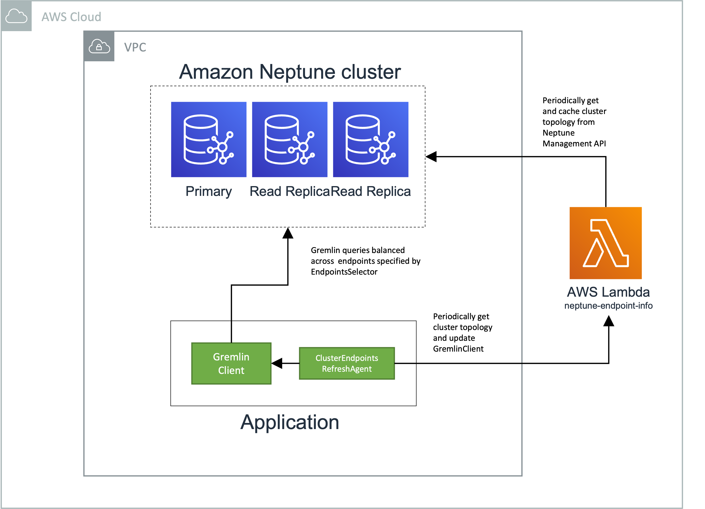

# Neptune Gremlin Client

A Java Gremlin client for Amazon Neptune that allows you to change the endpoints used by the client as it is running. Includes an endpoint refresh agent that can get cluster topology details, and update the client on a periodic basis. You can supply your own custom endpoint selectors to configure the client for a subset of instances in your cluster based on tags, instance types, instance IDs, Availability Zones, etc.

The client also provides support for connecting to Neptune via a proxy such as a network or application load balancer, as an alternative to using an endpoint refresh agent and custom endpoint selectors.

See [Migrating from version 1 of the Neptune Gremlin Client](#migrating-from-version-1-of-the-neptune-gremlin-client) if you are migrating an application from version 1.x.x of the Neptune Gremlin Client.

## Example

The following example shows how to build a `GremlinClient` that connects to and round-robins requests across all available Neptune serverless instances that have been tagged "analytics". The list of endpoints that match this selection criteria is refreshed every 60 seconds. The refresh agent that updates the list of endpoints uses an AWS Lambda proxy function to retrieve details of the Neptune database's cluster topology.

```
EndpointsSelector selector = (cluster) ->
        new EndpointCollection(
                cluster.getInstances().stream()
                        .filter(i -> i.hasTag("workload", "analytics"))
                        .filter(i -> i.getInstanceType().equals("db.serverless"))
                        .filter(NeptuneInstanceMetadata::isAvailable)
                        .collect(Collectors.toList()));

ClusterEndpointsRefreshAgent refreshAgent = 
        ClusterEndpointsRefreshAgent.lambdaProxy("neptune-endpoints-info-lambda");

GremlinCluster cluster = NeptuneGremlinClusterBuilder.build()
        .enableIamAuth(true)
        .addContactPoints(refreshAgent.getEndpoints(selector))
        .create();

GremlinClient client = cluster.connect();

refreshAgent.startPollingNeptuneAPI(
        RefreshTask.refresh(client, selector),
        60,
        TimeUnit.SECONDS);

DriverRemoteConnection connection = DriverRemoteConnection.using(client);
GraphTraversalSource g = AnonymousTraversalSource.traversal().withRemote(connection);

for (int i = 0; i < 100; i++) {
    List<Map<Object, Object>> results = g.V().limit(10).valueMap(true).toList();
    for (Map<Object, Object> result : results) {
        //Do nothing
    }
}

refreshAgent.close();
client.close();
cluster.close();
```

## Dependencies

### Maven

```
<dependency>
    <groupId>software.amazon.neptune</groupId>
    <artifactId>gremlin-client</artifactId>
    <version>2.0.1</version>
</dependency>
```

## Table of Contents

  - [Overview](#overview)
    - [Distributing requests across an Amazon Neptune cluster](#distributing-requests-across-an-amazon-neptune-cluster)
  - [Creating a GremlinCluster and GremlinClient](#creating-a-gremlincluster-and-gremlinclient)
    - [Configuration](#configuration)
  - [Using a ClusterEndpointsRefreshAgent](#using-a-clusterendpointsrefreshagent)
    - [Using an AWS Lambda proxy to retrieve cluster topology](#using-an-aws-lambda-proxy-to-retrieve-cluster-topology)
      - [Installing the neptune-endpoints-info AWS Lambda function](#installing-the-neptune-endpoints-info-aws-lambda-function)
      - [Lambda proxy environment variables](#lambda-proxy-environment-variables)
      - [Suspending endpoints using the AWS Lambda proxy](#suspending-endpoints-using-the-aws-lambda-proxy)
    - [Using a ClusterEndpointsRefreshAgent to query the Neptune Management API directly](#using-a-clusterendpointsrefreshagent-to-query-the-neptune-management-api-directly)
    - [ClusterEndpointsRefreshAgent credentials](#clusterendpointsrefreshagent-credentials)
      - [Accessing the Neptune Management API or Lambda proxy across accounts](#accessing-the-neptune-management-api-or-lambda-proxy-across-accounts)
  - [EndpointsSelector](#endpointsselector)
    - [EndpointsType](#endpointstype)
  - [Connecting to an IAM auth enabled Neptune database](#connecting-to-an-iam-auth-enabled-neptune-database)
    - [Service region](#service-region)
  - [Connecting via a proxy](#connecting-via-a-proxy)
    - [Configuring proxy connections for an IAM auth enabled Neptune database](#configuring-proxy-connections-for-an-iam-auth-enabled-neptune-database)
    - [Removing the Host header before sending a Sigv4 signed request to a proxy](#removing-the-host-header-before-sending-a-sigv4-signed-request-to-a-proxy)
  - [Using a load balancer with host-based routing](#using-a-load-balancer-with-host-based-routing)
    - [Using an AWS Application Load Balancer](#using-an-aws-application-load-balancer)
      - [Create target groups](#step-1-create-target-groups)
      - [Create an Application Load Balancer](#step-2-create-an-application-load-balancer)
      - [Preserve host headers](#step-3-preserve-host-headers)
      - [Configure host-based routing](#step-4-configure-host-based-routing)
      - [Configure the Neptune Gremlin Client](#step-5-configure-the-neptune-gremlin-client)
  - [Usage](#usage)
    - [Use database instance tags to control endpoint visibility](#use-database-instance-tags-to-control-endpoint-visibility)
      - [Prewarm replicas](#prewarm-replicas)
      - [Register targets with load balancer](#register-targets-with-load-balancer)
    - [Backoff and retry](#backoff-and-retry)
      - [RetryUtils](#retryutils)
      - [Backoff and retry when creating a  GremlinCluster and GremlinClient](#backoff-and-retry-when-creating-a-gremlincluster-and-gremlinclient)
      - [Backoff and retry when submitting a query](#backoff-and-retry-when-submitting-a-query)
    - [Connection timeouts](#connection-timeouts)
      - [Force refresh of endpoints when waiting to acquire a connection](#force-refresh-of-endpoints-when-waiting-to-acquire-a-connection)
    - [Transactions](#transactions)
    - [Migrating from version 1 of the Neptune Gremlin Client](#migrating-from-version-1-of-the-neptune-gremlin-client)
  - [Demo](#demo)
    - [CustomSelectorsDemo](#customselectorsdemo)
    - [RefreshAgentDemo](#refreshagentdemo)
    - [RetryDemo](#retrydemo)
    - [TxDemo](#txdemo)

## Overview

With the Neptune Gremlin Client you create a `GremlinCluster` and `GremlinClient` much as you would create a `Cluster` and `Client` with the Tinkerpop Java driver. The Neptune Gremlin Client is designed to be a near-drop-in replacement for the Java driver. Internally, it uses the Java driver to connect to Neptune and issue queries.

You populate a `GremlinCluster` with one or more endpoints, or contact points, when you first create a client, but you can also refresh this list of endpoints from your code whenever you want. The `GremlinClient` exposes a `refreshEndpoints()` method that allows you to supply a new set of endpoints. This allows a running application to adapt to changes in your Neptune database's cluster topology.

The easiest way to automatically refresh the list of endpoints is to use a `ClusterEndpointsRefreshAgent`. The agent can be configured to periodically discover the database cluster's current topology, select a set of endpoints, and update the client.

A `ClusterEndpointsRefreshAgent` can be configured to get the database cluster's topology directly from the [Neptune Management API](https://docs.aws.amazon.com/neptune/latest/userguide/api.html), or from an AWS Lambda proxy function, which fetches and caches the cluster topology from the Management API on behalf of multiple clients. Unless you have a very small number of client instances (1-5) in your application, we recommend using a Lambda proxy to get the cluster toplogy. This reduces the risk of the Management API throttling requests from many clients.

Your application can then use an `EndpointsSelector` to select an appropriate set of endpoints from the current cluster topology.

The following diagram shows how an application can use a `GremlinClient`, `ClusterEndpointsRefreshAgent`, and AWS Lambda proxy function to access a Neptune database:



The following diagram shows how an application can use a `GremlinClient`, and a `ClusterEndpointsRefreshAgent` that gets cluster topology information directly from the Neptune Management API, to access a Neptune database:


### Distributing requests across an Amazon Neptune cluster

One of the benefits of the Neptune Gremlin Client is that it helps you distribute requests evenly across multiple read replicas in a Neptune cluster. 

If you're building an application that needs to distribute requests across replicas, your first choice will typically be the [reader endpoint](https://docs.aws.amazon.com/neptune/latest/userguide/feature-overview-endpoints.html#feature-overview-reader-endpoints), which balances _connections_ across replicas. The reader endpoint continues to balance connections across replicas even if you change the cluster topology by adding or removing replicas, or promoting a replica to become the new primary.

However, in some circumstances using the reader endpoint can result in an uneven use of cluster resources. The reader endpoint works by periodically changing the host that the DNS entry points to. If a client opens a lot of connections before the DNS entry changes, all the connection requests are sent to a single Neptune instance. The same thing happens if DNS caching occurs in the application layer: the client ends up using the same replica over and over again. If an application opens a lot of connections to the reader endpoint at the same time, many of those connections can end up being tied to a single replica.

The Neptune Gremlin Client more fairly distributes connections and requests across a set of instances in a Neptune cluster. The client works by creating a connection pool for each [_instance endpoint_](https://docs.aws.amazon.com/neptune/latest/userguide/feature-overview-endpoints.html#feature-overview-instance-endpoints) in a given list of endpoints, and distributing requests (queries, not connections) in a round-robin fashion across these connection pools, thereby ensuring a more even distribution of work, and higher read throughput. 

Note that the Neptune Gremlin Client will only round-robin requests across multiple read replicas if you supply it with a list of replica _instance endpoints_. If you supply it with the reader endpoint, you may continue to see connections and requests unevenly distributed across the cluster.

## Creating a GremlinCluster and GremlinClient

You create a `GremlinCluster` and `GremlinClient` using a `NeptuneGremlinClusterBuilder`:

```
GremlinCluster cluster = NeptuneGremlinClusterBuilder.build()
        .addContactPoints("replica-endpoint-1", "replica-endpoint-2", "replica-endpoint-3")
        .create();       
 
GremlinClient client = cluster.connect();
 
DriverRemoteConnection connection = DriverRemoteConnection.using(client);
GraphTraversalSource g = AnonymousTraversalSource.traversal().withRemote(connection);
 
// Use g throughout the lifetime of your application to submit queries to Neptune
 
client.close();
cluster.close();
```

The `NeptuneGremlinClusterBuilder` is configured to use port 8182, and enable SSL by default.
 
Use the `GraphTraversalSource` created here throughout the lifetime of your application, and across threads – just as you would with the TinkerPop Java driver client. The `GremlinClient` ensures that requests are distributed across the current set of endpoints in a round-robin fashion.
 
The `GremlinClient` has a `refreshEndpoints()` method that allows you to submit a fresh list of endpoint addresses. When the list of endpoints changes, subsequent requests will be distributed across the new set of endpoints.
 
Once you have a reference to a `GremlinClient`, you can call this `refreshEndpoints()` method whenever you discover the cluster topology has changed. You could subscribe to SNS events, for example, and refresh the list whenever an instance is added or removed, or when you detect a failover. 

To update the list of endpoint addresses:
 
```
client.refreshEndpoints("new-replica-endpoint-1", "new-replica-endpoint-2", "new-replica-endpoint-3")
```
 
You can also use a `ClusterEndpointsRefreshAgent` to update the endpoints automatically on a periodic basis.

Because the cluster topology can change at any moment as a result of both planned and unplanned events, you should [wrap all queries with an exception handler](#backoff-and-retry). Should a query fail because the underlying client connection has been closed, you can attempt a retry.

### Configuration

Most of the best practices for [using the TinkerPop Gremlin Java client with Amazon Neptune](https://docs.aws.amazon.com/neptune/latest/userguide/best-practices-gremlin-java-client.html) apply to the Neptune Gremlin Client.

One important point to note is that with the Neptune Gremlin Client, all connection and connection pool settings specified using the `NeptuneGremlinClusterBuilder` apply on a _per endpoint_ basis. For example, if you configure the `NeptuneGremlinClusterBuilder` with three endpoints, then it will create a client with three connection pools. Each connection pool will be configured separately with the connection pool settings specified using the `NeptuneGremlinClusterBuilder`.

Old versions of the TinkerPop Gremlin Java client configured with a `minConnectionPoolSize` smaller than the `maxConnectionPoolSize` could sometimes appear to hang if they needed to add a new connection to the pool to handle an increase in traffic. If the thread used to schedule the creation of a new connection was already doing other work, it sometimes happened that the new connection would never be created, thereby blocking the client from sending any further requests. To mitigate this, we used to recommend configuring the client with `minConnectionPoolSize` equal to `maxConnectionPoolSize`, so that all connections in the pool were created eagerly.

This issue has been addressed in newer versions of the TinkerPop Gremlin Java client (on which the Neptune Gremlin Client depends), so the former advice no longer applies. Consider setting `minConnectionPoolSize` (per endpoint) to accomodate your steady traffic, and `maxConnectionPoolSize` the peak in your traffic. The exact values will depend on your workload, and may require some experimentation. If in doubt, leave the builder to use the default values (`2` and `8` respectively).

If you are using the Neptune Gremlin Client in an AWS Lambda function, consider setting both `minConnectionPoolSize` and `maxConnectionPoolSize` to `1`. Because concurrent client requests to your Lambda functions are handled by different function instances running in separate execution contexts, there's no need to maintain a pool of connections to handle concurrent requests inside each function instance.

## Using a ClusterEndpointsRefreshAgent

The `ClusterEndpointsRefreshAgent` allows you to schedule endpoint updates to a `GremlinClient`. The agent can be configured to periodically discover the database cluster's current topology, select a set of endpoints using an `EndpointsSelector`, and update a client.

A `ClusterEndpointsRefreshAgent` can be configured to get the database cluster's topology directly from the [Neptune Management API](https://docs.aws.amazon.com/neptune/latest/userguide/api.html), or from an AWS Lambda proxy function, which fetches and caches the cluster topology from the Management API on behalf of multiple clients. **Unless you have a very small number of client instances (1-5) in your application, you should use a Lambda proxy to get the cluster toplogy.** This reduces the risk of the Management API throttling requests from many clients.

### Using an AWS Lambda proxy to retrieve cluster topology

The following example shows how to create a `ClusterEndpointsRefreshAgent` that queries an AWS Lambda proxy function to discover the database cluster's current topology. The proxy function periodically fetches and caches the cluster topology from the Management API on behalf of multiple clients. When the agent gets the cluster topology from the Lambda function, it then updates a `GremlinClient` with the current set of read replica endpoints. Notice how the builder's `addContactPoints()` method uses `refreshAgent.getEndpoints(selector)` to get an initial list of endpoints from the refresh agent using the selector.


```
EndpointsSelector selector = EndpointsType.ReadReplicas;

ClusterEndpointsRefreshAgent refreshAgent = 
        ClusterEndpointsRefreshAgent.lambdaProxy("neptune-endpoints-info-lambda");

GremlinCluster cluster = NeptuneGremlinClusterBuilder.build()
        .addContactPoints(refreshAgent.getEndpoints(selector))
        .create();       
 
GremlinClient client = cluster.connect();

refreshAgent.startPollingNeptuneAPI(
        RefreshTask.refresh(client, selector),
        60,
        TimeUnit.SECONDS);
        
```

When you use a `ClusterEndpointsRefreshAgent` to query an AWS Lambda proxy function for cluster topology information, the identity under which you're running the agent must be authorized to perform `lambda:InvokeFunction` for the proxy Lambda function. See [ClusterEndpointsRefreshAgent credentials](#clusterendpointsrefreshagent-credentials) for details of supplying credentials to the refresh agent.

#### Installing the neptune-endpoints-info AWS Lambda function

  1. Build the AWS Lambda proxy from [source](./neptune-endpoints-info-lambda), or download the [latest release](https://github.com/aws/neptune-gremlin-client/releases/latest), and put it an Amazon S3 bucket. 
  2. Install the Lambda proxy in your account using [this CloudFormation template](./cloudformation-templates/neptune-endpoints-info-lambda.json). The template includes parameters for the current Neptune cluster ID, and the S3 source for the Lambda proxy jar (from step 1).
  3. Ensure all parts of your application are using the latest Neptune Gremlin Client.
  4. The Neptune Gremlin Client should be configured to fetch the cluster topology information from the Lambda proxy using the `ClusterEndpointsRefreshAgent.lambdaProxy()` method, as per the [example above](#using-an-aws-lambda-proxy-to-retrieve-cluster-topology).
  
#### Lambda proxy environment variables

The AWS Lambda proxy has the following environment variables:

  - `clusterId` – The cluster ID of the Amazon Neptune cluster to be polled for endpoint information.
  - `pollingIntervalSeconds` – The number of seconds between polls.
  - `suspended` – Determines whether specific endpoints will be suspended (see the next section). Valid values are: `none`, `all`, `writer`, `reader`. 
  
#### Suspending endpoints using the AWS Lambda proxy

The Lambda proxy has a `suspended` environment variable that accepts the following values: `none`, `all`, `writer`, `reader`. You can use this environment variable to _suspend_ specific types of endpoint. Suspended endpoints will not be chosen by the client when it applies a selector to the cluster topology.

To suspend a particular endpoint type, change the variable value, save the change, and once it has propagated (this may take up to a minute), all clients that use the Lambda proxy will see the specified endpoints as being suspended. Setting the value to `reader`, for example, will ensure that all instances currently in a reader role will be seen as suspended.

You can use this feature to prevent traffic to your cluster while you perform maintenance, upgrade or migration activities. Suspended endpoints apply back pressure in the client, preventing it from sending queries to the database cluster. To manage this back pressure, your application will have to handle an `EndpointsUnavailableException`. This exception can occur in two different places:
 
  - When you call `NeptuneGremlinClusterBuilder.create()`.
  - When you submit a query using an existing `GraphTraversalSource`.
 
The `EndpointsUnavailableException` will appear as the root cause: invariably, it is wrapped in a `RemoteConnectionexception`, or similar. The only reason you should see an `EndpointsUnavailableException` is because the endpoints have been suspended. 

### Using a ClusterEndpointsRefreshAgent to query the Neptune Management API directly

The following example shows how to create a `ClusterEndpointsRefreshAgent` that queries the [Neptune Management API](https://docs.aws.amazon.com/neptune/latest/userguide/api.html) to discover the database cluster's current topology. The agent then updates a `GremlinClient` with the current set of read replica endpoints. Notice how the builder's `addContactPoints()` method uses `refreshAgent.getEndpoints(selector)` to get an initial list of endpoints from the refresh agent using the selector.

```
EndpointsSelector selector = EndpointsType.ReadReplicas;

ClusterEndpointsRefreshAgent refreshAgent = 
        ClusterEndpointsRefreshAgent.managementApi("cluster-id");

GremlinCluster cluster = NeptuneGremlinClusterBuilder.build()
        .addContactPoints(refreshAgent.getEndpoints(selector))
        .create();       
 
GremlinClient client = cluster.connect();

refreshAgent.startPollingNeptuneAPI(
        RefreshTask.refresh(client, selector),
        60,
        TimeUnit.SECONDS);
        
```

When you use a `ClusterEndpointsRefreshAgent` to query the Neptune Management API directly, the identity under which you're running the agent must be authorized to perform `rds:DescribeDBClusters`,  `rds:DescribeDBInstances` and `rds:ListTagsForResource` for your Neptune cluster. See [ClusterEndpointsRefreshAgent credentials](#clusterendpointsrefreshagent-credentials) for details of supplying credentials to the refresh agent.

When the Neptune Management API experiences a high rate of requests, it starts throttling API calls. If you have a lot of clients frequently polling for endpoint information, your application can very quickly experience throttling (in the form of HTTP 400 throttling exceptions).

Because of this throttling behaviour, if your application uses a lot of concurrent `GremlinClient` and `ClusterEndpointsRefreshAgent` instances, instead of querying the Management API directly, you should [proxy endpoint refresh requests through an AWS Lambda function](#using-an-aws-lambda-proxy-to-retrieve-cluster-topology). The Lambda function can periodically query the Management API and then cache the results on behalf of its clients.

### ClusterEndpointsRefreshAgent credentials 

When you create a `ClusterEndpointsRefreshAgent` using one of the `lambaProxy` or `managementApi` factory methods, you can supply the credentials necessary to invoke the AWS Lambda proxy, or the Neptune Management API, as appropriate. These can be a separate set of credentials from the [credentials used to query your Neptune database](#connecting-to-an-iam-auth-enabled-neptune-database).

You can supply the name of a named profile in a local profile configuration file:

```
String profileName = "my-profile";

// Using a Lambda proxy
ClusterEndpointsRefreshAgent lambdaProxyRefreshAgent = 
        ClusterEndpointsRefreshAgent.lambdaProxy("neptune-endpoints-info-lambda", "eu-west-1", profileName);
        
// Querying the Neptune Management API
ClusterEndpointsRefreshAgent managementApiRefreshAgent = 
        ClusterEndpointsRefreshAgent.managementApi("my-cluster-id", "eu-west-1", profileName);        
```

Or you can supply an implementation of `AWSCredentialsProvider`:

```
AWSCredentialsProvider credentialsProvider = 
        new ProfileCredentialsProvider("my-profile")

// Using a Lambda proxy
ClusterEndpointsRefreshAgent lambdaProxyRefreshAgent = 
        ClusterEndpointsRefreshAgent.lambdaProxy("neptune-endpoints-info-lambda", "eu-west-1", credentialsProvider);       

// Querying the Neptune Management API
ClusterEndpointsRefreshAgent managementApiRefreshAgent = 
        ClusterEndpointsRefreshAgent.managementApi("my-cluster-id", "eu-west-1", credentialsProvider);        
```

#### Accessing the Neptune Management API or Lambda proxy across accounts

Normally your application, Neptune database and Lambda proxy will be in the same account. If, however, you need to assume a cross-account role to contact the Lambda proxy or Neptune Management API, you can use an `STSAssumeRoleSessionCredentialsProvider` to create a temporary session for authentication to a resource in another account.

Before you access the Management API or Lambda proxy across accounts, follow the instructions in [this tutorial](https://docs.aws.amazon.com/IAM/latest/UserGuide/tutorial_cross-account-with-roles.html) to delegate access to the resources across AWS accounts using IAM roles. In line with this tutorial, you'll need to:

  1. Create a managed policy and role in the resource account (the account containing the Neptune database cluster or the AWS Lambda proxy) that allows trusted users to access the resource.
  2. Grant access to this role to the identity under which you're running the refresh agent.
  3. Create an `STSAssumeRoleSessionCredentialsProvider` that can assume the role, and which can be passed to the refresh agent.

If you want to access the Neptune Management API across accounts, the managed policy document that you create in the Neptune account in [Step 1](https://docs.aws.amazon.com/IAM/latest/UserGuide/tutorial_cross-account-with-roles.html#tutorial_cross-account-with-roles-1) of the tutorial should look like this :

```
{
  "Version": "2012-10-17",
  "Statement": [
    {
      "Effect": "Allow",
      "Action": [
        "rds:DescribeDBClusters"
      ],
      "Resource": "<NEPTUNE_CLUSTER_ARN>"
    },
    {
      "Effect": "Allow",
      "Action": [
        "rds:DescribeDBInstances",
        "rds:ListTagsForResource"
      ],
      "Resource": "arn:${Partition}:rds:${Region}:${Account}:db:*"
    }
  ]
}
```

In the above example, replace `<NEPTUNE_CLUSTER_ARN>` with the ARN of your Neptune database cluster, and the `${Partition}`, `${Region}` and `${Account}` placeholders with the relevant values for your account.

If you want to access the Lambda proxy across accounts, the managed policy document that you create in the Neptune account in [Step 1](https://docs.aws.amazon.com/IAM/latest/UserGuide/tutorial_cross-account-with-roles.html#tutorial_cross-account-with-roles-1) of the tutorial should look like this:

```
{
  "Version": "2012-10-17",
  "Statement": [
    {
      "Effect": "Allow",
      "Action": [
        "lambda:InvokeFunction"
      ],
      "Resource": "<LAMBDA_ARN>"
    }
  ]
}
```

In the above example, replace `<LAMBDA_ARN>` with the ARN of your Lambda proxy function.

Once you've completed [Step 2](https://docs.aws.amazon.com/IAM/latest/UserGuide/tutorial_cross-account-with-roles.html#tutorial_cross-account-with-roles-2) of the tutorial, you can then create a refresh agent using an `STSAssumeRoleSessionCredentialsProvider`.

The following example shows how to access a Lambda proxy across accounts. Replace `<CROSS_ACCOUNT_ROLE_ARN>` with the ARN of the role created in [Step 1](https://docs.aws.amazon.com/IAM/latest/UserGuide/tutorial_cross-account-with-roles.html#tutorial_cross-account-with-roles-1) of the tutorial:

 
```
String lambdaName = "neptune-endpoinst-info";
String lambdaRegion = "eu-west-1";
String crossAccountRoleArn = "<CROSS_ACCOUNT_ROLE_ARN>";

STSAssumeRoleSessionCredentialsProvider credentialsProvider =
        new STSAssumeRoleSessionCredentialsProvider.Builder(crossAccountRoleArn, "AssumeRoleSession1")
        .build();

ClusterEndpointsRefreshAgent refreshAgent = 
        ClusterEndpointsRefreshAgent.lambdaProxy(lambdaName, lambdaRegion, credentialsProvider);
```

The following example shows hot to access the Neptune aMnagement API across accounts. Replace `<CROSS_ACCOUNT_ROLE_ARN>` with the ARN of the role created in [Step 1](https://docs.aws.amazon.com/IAM/latest/UserGuide/tutorial_cross-account-with-roles.html#tutorial_cross-account-with-roles-1) of the tutorial:

 
```
String clusterId = "my-cluster-id";
String neptuneRegion = "eu-west-1";
String crossAccountRoleArn = "<CROSS_ACCOUNT_ROLE_ARN>";

STSAssumeRoleSessionCredentialsProvider credentialsProvider =
        new STSAssumeRoleSessionCredentialsProvider.Builder(crossAccountRoleArn, "AssumeRoleSession1")
        .build();

ClusterEndpointsRefreshAgent refreshAgent = 
        ClusterEndpointsRefreshAgent.managementApi(clusterId, neptuneRegion, credentialsProvider);
```

If [AWS STS Regional endpoints](https://docs.aws.amazon.com/IAM/latest/UserGuide/id_credentials_temp_enable-regions.html) have been enabled in your account, you may want to configure the credentials provider for Regional STS endpoint access:

```
EndpointConfiguration regionEndpointConfig = new EndpointConfiguration("https://sts.eu-west-1.amazonaws.com", "eu-west-1");

AWSSecurityTokenService stsRegionalClient = AWSSecurityTokenServiceClientBuilder.standard()
        .withEndpointConfiguration(regionEndpointConfig)
        .build();
        
STSAssumeRoleSessionCredentialsProvider credentialsProvider =
        new STSAssumeRoleSessionCredentialsProvider.Builder(crossAccountRoleArn, "AssumeRoleSession1")
        .withStsClient(stsRegionalClient)
        .build();
``` 

Remember to call `close()` on the credentials provider when it is no longer needed. This shuts down the thread that performs asynchronous credential refreshing.

## EndpointsSelector

The `EndpointsSelector` interface allows you to create objects that encapuslate custom endpoint selection logic. When a selector's `getEndpoints()` method is invoked, it is passed a `NeptuneClusterMetadata` object that contains details about the database cluster's topology. In your `getEndpoints()` implementation, you can then filter instances in the cluster by properties such as role (reader or writer), instance ID, instance type, tags, and Availability Zone. 

The following example shows how to create an `EndpointsSelector` that returns the endpoints of available Neptune serverless instances in a cluster that have been tagged "analytics":

```
EndpointsSelector selector = (cluster) ->
        new EndpointCollection(
                cluster.getInstances().stream()
                        .filter(i -> i.hasTag("workload", "analytics"))
                        .filter(i -> i.getInstanceType().equals("db.serverless"))
                        .filter(NeptuneInstanceMetadata::isAvailable)
                        .collect(Collectors.toList()));

```

The `isAvailable()` property of a `NeptuneInstanceMetadata` object indicates whether an endpoint is _likely_ to be available. An endpoint is considered likely to be available if the instance itself is in one of the following states: `available`, `backing-up`, `modifying`, `upgrading`.

The full list of database instances states can be found [here](https://docs.aws.amazon.com/AmazonRDS/latest/UserGuide/accessing-monitoring.html). Note that not all of these states are relevant to Amazon Neptune (for example, `converting-to-vpc` does not apply to Amazon Neptune database instances).

We say that `isAvailable()` indicates that an endpoint is _likely_ available. There is no guarantee that the endpoint is actually available. For example, while an instance is `upgrading`, there can be short periods when the endpoint is _not_ available. During the upgrade process, instances are sometimes restarted, and while this is happening the instance endpoint will not be available, even though the state is `upgrading`.

If your selection criteria returns an empty list of endpoints, you may want to fall back to using the [cluster or reader endpoints](https://docs.aws.amazon.com/neptune/latest/userguide/feature-overview-endpoints.html). That way, your client will always have at least one endpoint, even if because of some issue outside of its control, it cannot currently connect to the database cluster. The following example falls back to the reader endpoint if there are no instances matching the selection criteria:

```
EndpointsSelector writerSelector = (cluster) -> {
                List<NeptuneInstanceMetadata> endpoints = cluster.getInstances().stream()
                        .filter(i -> i.hasTag("workload", "analytics"))
                        .filter(i -> i.getInstanceType().equals("db.serverless"))
                        .filter(NeptuneInstanceMetadata::isAvailable)
                        .collect(Collectors.toList());
                return endpoints.isEmpty() ?
                        new EndpointCollection(Collections.singletonList(cluster.getReaderEndpoint())) :
                        new EndpointCollection(endpoints);
            };
```
### EndpointsType

The `EndpointsType` enum provides implementations of `EndpointsSelector` for some common use cases:

  * `EndpointsType.All` –  Returns all available instance (writer and read replicas) endpoints, or, if there are no available instance endpoints, the [reader endpoint](https://docs.aws.amazon.com/neptune/latest/userguide/feature-overview-endpoints.html#feature-overview-reader-endpoints).
  * `EndpointsType.Primary` – Returns the primary (writer) instance endpoint if it is available, or the [cluster endpoint](https://docs.aws.amazon.com/neptune/latest/userguide/feature-overview-endpoints.html#feature-overview-cluster-endpoints) if the primary instance endpoint is not available.
  * `EndpointsType.ReadReplicas` – Returns all available read replica instance endpoints, or, if there are no replica instance endpoints, the [reader endpoint](https://docs.aws.amazon.com/neptune/latest/userguide/feature-overview-endpoints.html#feature-overview-reader-endpoints).
  * `EndpointsType.ClusterEndpoint` – Returns the [cluster endpoint](https://docs.aws.amazon.com/neptune/latest/userguide/feature-overview-endpoints.html#feature-overview-cluster-endpoints).
  * `EndpointsType.ReaderEndpoint` – Returns the [reader endpoint](https://docs.aws.amazon.com/neptune/latest/userguide/feature-overview-endpoints.html#feature-overview-reader-endpoints).
 

The following example shows how to use the `ReadReplicas` enum value to create and refresh a client:

```
EndpointsSelector selector = EndpointsType.ReadReplicas;

ClusterEndpointsRefreshAgent refreshAgent = 
        new ClusterEndpointsRefreshAgent("cluster-id");

GremlinCluster cluster = NeptuneGremlinClusterBuilder.build()
        .addContactPoints(refreshAgent.getEndpoints(selector))
        .create();       
 
GremlinClient client = cluster.connect();

refreshAgent.startPollingNeptuneAPI(
        RefreshTask.refresh(client, selector),
        60,
        TimeUnit.SECONDS);
        
```

## Connecting to an IAM auth enabled Neptune database
 
When the Neptune Gremlin Client connects to an IAM auth enabled database it uses a `DefaultAWSCredentialsProviderChain` to supply credentials to the signing process. You can modify this behavior in a couple of different ways.

To customize which profile is sourced from a local credentials file, use the `iamProfile()` builder method: 

```
GremlinCluster cluster = NeptuneGremlinClusterBuilder.build()
        .enableIamAuth(true)
        .addContactPoint("reader-1")
        .iamProfile("profile-name")
        .create();
```

Or you can supply your own `AwsCredentialsProvider` implementation:

```
GremlinCluster cluster = NeptuneGremlinClusterBuilder.build()
        .enableIamAuth(true)
        .addContactPoint("reader-1")
        .credentials(new ProfileCredentialsProvider("profile-name"))
        .create();
```

The client includes a load balancer-aware handshake interceptor that will [sign requests and adjust HTTP headers as necessary](https://github.com/aws-samples/aws-dbs-refarch-graph/tree/master/src/connecting-using-a-load-balancer). However, you can replace this interceptor with your own implementation:

```
GremlinCluster cluster = NeptuneGremlinClusterBuilder.build()
				.enableIamAuth(true)
        .addContactPoint("reader-1")
        .handshakeInterceptor(r -> { 
              NeptuneNettyHttpSigV4Signer sigV4Signer = new NeptuneNettyHttpSigV4Signer("eu-west-1", new DefaultAWSCredentialsProviderChain());
              sigV4Signer.signRequest(r);
              return r;
        })
        .create();
```

### Service region

If you have IAM database authentication enabled for your Neptune database, you _must_ specify the Neptune service region when connecting from your client.

By default, the Neptune Gremlin Client will attempt to source this region parameter from several different places:

  - The **SERVICE_REGION** environment variable.
  - The **SERVICE_REGION** system property.
  - The **AWS_REGION** Lambda environment variable (this assumes Neptune is in the same region as the Lambda function).
  - Using the `Regions.getCurrentRegion()` method from the [AWS SDK for Java](https://aws.amazon.com/blogs/developer/determining-an-applications-current-region/) (this assumes Neptune is in the current region).

You can also specify the service region when creating a `GremlinCluster` using the `NeptuneGremlinClusterBuilder.serviceRegion()` builder method:

```
GremlinCluster cluster = NeptuneGremlinClusterBuilder.build()
        .enableIamAuth(true)
        .addContactPoint("reader-1")
        .serviceRegion("eu-west-1")
        .create();
```

## Connecting via a proxy

As an _alternative_ to connecting directly to Neptune and using a refresh agent to adjust the pool of connections to match the cluster's current topology, you can connect via a proxy, such as a load balancer. To connect via a proxy, use the `proxyAddress()` and `proxyPort()` builder methods. If the connection to the proxy does not require SSL, disable SSL:

```
GremlinCluster cluster = NeptuneGremlinClusterBuilder.build()
        .enableSsl(false)
        .proxyAddress("http://my-proxy")
        .proxyPort(80)
        .serviceRegion("eu-west-1")
        .create();
```

If your Neptune database does _not_ have IAM auth enabled, you do not need to add any additional contact points.

### Configuring proxy connections for an IAM auth enabled Neptune database

If your Neptune database has IAM auth enabled, HTTP requests to the database must be signed using AWS Signature Version 4. Unless your proxy implements the signing process, you will have to sign requests in the client. The client must sign the request using the Neptune endpoint that will recieve the request, and include an HTTP `Host` header whose value is `<neptune-endpoint-dns:port>`. 

Use the `enableIamAuth()` and `serviceRegion()` builder methods to sign requests.

When using a proxy, besides specifying the proxy address and port, you will also have to specify the ultimate Neptune endpoint to which a request will be directed. You do this using the `addContactPoint()` builder method. _The endpoint you specify here must match the Neptune endpoint to which the proxy forwards requests._ There's no point using a refresh agent to supply a list of endpoints to the client unless the proxy can forward requests to the correct Neptune endpoint based on the value of the `Host` header in the request sent to the proxy.

Here's an example of creating a client that connects through a proxy to an IAM auth-enabled Neptune database, where the proxy has been configured to forward requests to the database's cluster endpoint:

```
GremlinCluster cluster = NeptuneGremlinClusterBuilder.build()
        .enableIamAuth(true)
        .serviceRegion("eu-west-1")
        .addContactPoint("my-db.cluster-cktfjywp6uxn.eu-west-1.neptune.amazonaws.com") // cluster endpoint
        .proxyAddress("my-proxy")
        .proxyPort(80)
        .create();
```

### Removing the Host header before sending a Sigv4 signed request to a proxy

In some circumstances, you may need to remove the HTTP `Host` header after signing the request, but before sending it to the proxy. For example, your proxy may add a `Host` header to the request: if that's the case, you don't want the request when it arrives at the Neptune endpoint to contain _two_ `Host` headers:

```
GremlinCluster cluster = NeptuneGremlinClusterBuilder.build()
        .enableIamAuth(true)
        .serviceRegion("eu-west-1")
        .addContactPoint("my-db.cluster-cktfjywp6uxn.eu-west-1.neptune.amazonaws.com") // cluster endpoint
        .proxyAddress("my-proxy")
        .proxyPort(80)
        .proxyRemoveHostHeader(true)
        .serviceRegion("eu-west-1")
        .create();
```

## Using a load balancer with host-based routing

As of Neptune Gremlin Client version 2.0.1 you can use the Neptune Gremlin Client with a load balancer that supports host-based routing to balance requests across instances in your database cluster as selected by an `EndpointsSelector`. This allows you to use custom endpoint selection logic in the client and still distribute requests across the instances in the selection set.

For this solution to work you must set up host-based routing in your load balancer. 

### Using an AWS Application Load Balancer

The following steps describe how to create an AWS Application Load Balancer in your Neptune VPC and configure it for host-based routing to individual database endpoints. Note, you **must** configure the [Preserve host headers](#step-3-preserve-host-headers) attribute on your laod balancer for this solution to work with an IAM-auth eneabled database.

#### Limitations

The solution presented here uses a fixed set of target groups, one per database instance endpoint. If your database cluster topology changes, you may need to remove some of those target groups and add others. If you don't keep the target groups up-to-date with the cluster topology, topology changes that trigger a refresh of the connection pools and connection selection logic in your Neptune Gremlin Client instances may lead to connection errors in the client.

#### Step 1. Create target groups

Create a [separate target group](https://docs.aws.amazon.com/elasticloadbalancing/latest/application/load-balancer-target-groups.html) for each instance in your cluster. 

##### Specify group details

Under **Basic configuration**:

  - Select **IP addresses** as the target type.
  - Give the target group a name that clearly indicates which instance it is associated with.
  - Select the `HTTPS` protocol and port `8182` (or whatever port your database cluster is using).
  - Select the Neptune VPC.

Under **Health checks**:

  - The health check protocol should already be set to `HTTPS`.
  - Enter `/status` for the health check path.
  - If your Neptune database is secured with IAM database authentication, you'll need to update the **Advanced health check settings**: set the success codes to `200-403`. 
  
Click **Next**.
  
##### Register targets

Under **IP addresses**:

  - Add the IPv4 address of the instance endpoint to the target group and click the **Include as pending below** button (the port should already be set to `8182`). You can find the private IP address of the instance endpoint using `dig +short <endpoint>` from your terminal.

Click **Create target group**.

Repeat this process for each instance in your database cluster.

#### Step 2. Create an Application Load Balancer

##### Compare and select load balancer type

Under **Load balancer types** choose **Application Load Balancer** and click **Create**.

##### Create Application Load Balancer

Under **Network mapping**:

  - Select the Neptune VPC.
  - If you've configured the load balancer to be internet facing, you must choose at least two subnets in the Neptune VPC with routes to an internet gateway.
  
Under **Security groups**

  - Select one or more security groups that allow access to your load balancer from your clients.
  
Under **Listeners and routing**

  - Select the protocol clients will use to access the load balancer. If you select `HTTPS` you'll also have to configure the **Secure listener settings**.
  - At this point, you'll need to select one of your target groups to act as the target for the default action. 
  
Click **Create load balancer**

#### Step 3. Preserve host headers

Once you've created your load balancer, there's one further change you must make, which is to configure it to [preserve host headers](https://docs.aws.amazon.com/elasticloadbalancing/latest/application/application-load-balancers.html#host-header-preservation):

  - On the load balancer's **Attributes** tab, click **Edit**.
  - Under the **Packet handling** section, enable **Preserve host header**.
  - Click **Save changes**.
  
#### Step 4. Configure host-based routing

You can now set up [host-based routing rules](https://aws.amazon.com/blogs/aws/new-host-based-routing-support-for-aws-application-load-balancers/) for all your target groups.

  - Open the **Rules** tab for your load balancer's listener and click the **Manage rules** button.
  - Insert a rule for each of your target groups. Specify a `Host header... is` condition with the host name of the target group's instance endpoint, and a `Forward to...` action.
  - Consider modifying the default rule to return `404 - Not Found` for connection requests that cannot be routed to an existing target group.
  
#### Step 5. Configure the Neptune Gremlin Client

As pointed out in the [limitations](#limitations) section, this solution works with a fixed set of target groups, and therefore a fixed cluster topology. Because of this, there is little value in using a refresh agent to keep the client up-to-date with changes in the cluster topology. (If you automate the process of keeping the target groups and load balancer host-based routing rules up-to-date with changes in the cluster topology, then there certainly _is_ value in using a refresh agent.) You can, however, supply multiple instance endpoints when building a client, so as to ensure that requests are distributed across those endpoints.

Here's an example of creating a client that connects through an ALB to an IAM auth-enabled Neptune database. The ALB accepts traffic on port 80, so we disable SSL (connections from the ALB to Neptune, however, do use SSL). The ALB has been configured to use host-based routing, so we can provide multiple instance endpoints to the builder:

```
GremlinCluster cluster = NeptuneGremlinClusterBuilder.build()
        .enableIamAuth(true)
        .enableSsl(false)
        .serviceRegion("eu-west-1")
        .addContactPoints("replica-1-endpoint", "replica-2-endpoint", "replica-3-endpoint") // replica endpoints
        .proxyAddress("alb-endpoint")
        .proxyPort(80)
        .create();
```

## Usage

### Use database instance tags to control endpoint visibility

Using a custom `EndpointsSelector` you can select database instance endpoints based on the presence or absence of specific [database instance tags](https://docs.aws.amazon.com/neptune/latest/userguide/tagging.html) and tag values. You can employ this feature to manage the visibility of instance endpoints to clients while you undertake some out-of-band operations. The examples below describe two operational patterns that use this feature.

(Note that pre version 2.0.1 of the Neptune Gremlin Client, calls from a refresh agent to the Neptune Management API would cache tags for individual instances. This meant that changes to a database instance's tags would not be reflected in subsequent calls to get the cluster topology. This behaviour has changed in 2.0.1: the tags associated with a database instance now remain current with that instance.)

#### Prewarm replicas

Neptune's [auto-scaling feature](https://docs.aws.amazon.com/neptune/latest/userguide/manage-console-autoscaling.html) allows you to automatically adjust the number of Neptune replicas in a database cluster to meet your connectivity and workload requirements. Autoscaling can add replicas to your cluster on a sceduled basis or whenever the CPU utilization on existing instances exceeds a threshhold you specify in the autoscaling configuration.

New replicas, however, will start with a cold [buffer cache](https://aws.amazon.com/blogs/database/part-1-accelerate-graph-query-performance-with-caching-in-amazon-neptune/). For some applications, the additional query latency caused by a cold cache can impact the user experience. In these circumstances, you may want to warm the cache before 'releasing' the replica to clients. In this way, you improve the performance of the first queries directed to the replica, but at the expense of the replica taking a little longer to become available to service queries.

Neptune's `neptune_autoscaling_config` parameter allows you to specify one or more tags to be attached to newly provisioned autoscaled readers. You can use this feature in combination with a custom `EndpointsSelector` to hide cold replicas from clients.

Here's an example `neptune_autoscaling_config` JSON parameter that tags autoscaled readers with a "buffer-cache" tag with the value "cold":

```
"{
  \"tags\": [
    { \"key\" : \"buffer-cache\", \"value\" : \"cold\" }
  ],
  \"maintenanceWindow\" : \"wed:12:03-wed:12:33\",
  \"dbInstanceClass\" : \"db.r5.xlarge\"
}"
```

You can use this in combination with the following custom `EndpointsSelector`, which selects reader instances that _do not_ have a "buffer-cache" tag with the value "cold":

```
EndpointsSelector selector = (cluster) ->
        new EndpointCollection(
                cluster.getInstances().stream()
                        .filter(NeptuneInstanceMetadata::isReader)
                        .filter(i -> !i.hasTag("buffer-cache", "cold")) // ignore readers with cold caches
                        .collect(Collectors.toList()));
```

For this solution to work, you now need a process that can identify a newly provisioned reader, warm it with a query workload, and then delete its "buffer-cache" tag. When the tag is deleted, the instance will become visible to the application's Neptune Gremlin Clients.

The process you use for detecting and warming readers is out of scope for this documentation. Note, however, that if you are already using an [AWS Lambda proxy](#using-an-aws-lambda-proxy-to-retrieve-cluster-topology) in your application to retrieve cluster topology information, then you already have a source you can poll to discover cold readers (i.e. readers that _do_ have a "buffer-cache" tag with the value "cold").


#### Register targets with load balancer

The solution described elsewhere in this documentation for using an [AWS Application Load Balancer with the Neptune Gremlin Client](#using-an-aws-application-load-balancer) is limited insofar as it assumes a static cluster topology. If you want to use this solution with a refresh agent and `EndpointsSelector` that adapts to changes in the cluster toplogy, then you will need to introduce a process that can update a load balancer's target groups and host-based routing rules whenever instances are added to or removed from the cluster. Further, you will want to ensure that clients can only select an instance endpoint once it has been registered with the load balancer.

One way to ensure that a Neptune Gremlin Client instance only uses endpoints that have been registered with an ALB, is to tag instances that have been registered with the load balancer, and to use a custom `EndpointsSelector` that filters based on this tag. The following custom `EndpointsSelector` only selects reader instances that have an "alb-status" tag with the value "registered":

```
EndpointsSelector selector = (cluster) ->
        new EndpointCollection(
                cluster.getInstances().stream()
                        .filter(NeptuneInstanceMetadata::isReader)
                        .filter(i -> i.hasTag("alb-status", "registered"))
                        .collect(Collectors.toList()));
```

For this solution to work, you now need a process that can identify whenever an instance is added to or removed from the cluster, and which updates the target groups and host-based routing rules accordingly. This process should then tag the database instance after it has been registered with the load balancer.

The process you use for detecting cluster changes and updating target groups and routing rules is out of scope for this documentation. Note, however, that if you are already using an [AWS Lambda proxy](#using-an-aws-lambda-proxy-to-retrieve-cluster-topology) in your application to retrieve cluster topology information, then you already have a source you can poll to discover new, unregistered instances (i.e. instances that _do not_ have an "alb-status" tag with the value "registered").


### Backoff and retry

Connection issues occur: database instances failover or restart during upgrades, and intermittent issues in the network can break connections. Write queries sometimes throw an error, because of a `ConcurrentModificationException` or `ConstraintViolationException`, or because the primary has failed over, and the instance to which the query is sent can no longer support writes, triggering a `ReadOnlyViolationException`.

As a good practice you should consider implementing a backoff and retry strategy to handle these occurences and help your application recover and make forward progress. 

  - **Connection issues** – The TinkerPop Java driver, on which the Neptune Gremlin Client depends, automatically attempts to remediate connection issues. For example, if a host is considered unavailable, the driver will start a background task that tries to create a fresh connection. Because the driver handles reconnects automatically, if a connection issue occurs while your application is submitting a query, all your application has to do is backoff and retry the query.
  - `ConcurrentModificationException` – The Neptune transaction semantics mean that concurrent transactions can sometimes fail with a `ConcurrentModificationException`. In these situations, an [exponential backoff-and-retry mechanism can help resolve collisions](https://docs.aws.amazon.com/neptune/latest/userguide/transactions-exceptions.html). 
  - `ConstraintViolationException` – This can sometimes occur if you attempt to create an edge between vertices that have only recently been committed. If one or other of the vertices is not yet visible to the current transaction, a `ConstraintViolationException` can occur. You can retry the query in the expectation that the necessary items will become visible.
  - `ReadOnlyViolationException` – This occurs if the primary has failed over to another instance. By backing off and retrying the query, you give the Neptune Gremlin Client the opportunity to refresh its endpoint information.
  
There are two places in your application where you should consider implementing a backoff-and-retry strategy:

  - **Creating a `GremlinCluster` and `GremlinClient`** – In many applications you need create a `GremlinClient` only once, when the application starts. This client then lasts for the lifetime of the application. The situtaion is slightly different with serverless applications built using AWS Lambda functions. If you use Lambda functions to host your database access, each instance of a function will create its own `GremlinClient`.
  - **Submitting a query** – If you do use a backoff-and-retry strategy to handle write request issues, consider implementing idempotent queries for create and update requests. 
  
#### RetryUtils

The Neptune Gremlin Client includes a `RetryUtils` utility class with a `isRetryableException(Exception e)` method. The method encapsulates what we've learned running the Neptune Gremlin Client in long-running, high-throughput scenarios. The `Result` of this method indicates whether an exception represents a connection issue or query exception that would allow for an operation to be retried: 


```
try {
    
    // Your code
    
} catch (Exception e){
    RetryUtils.Result result = RetryUtils.isRetryableException(e);
    boolean isRetryable = result.isRetryable();
}
```

#### Backoff and retry when creating a GremlinCluster and GremlinClient

The following example uses [Retry4j](https://github.com/elennick/retry4j) (which is included with the Neptune Gremlin Client) for retries, and `RetryUtils.isRetryableException()` for determining whether an exception represents a connection issue or query exception that would allow for an operation to be retried.

In this example, the `GremlinCluster`, `GremlinClient`, and `GraphTraversalSource` are created inside a `Callable`, which is executed by a Retry4j `CallExecutor`. The `Callable` returns a `ClusterContext` – a simple container object provided by the Neptune Gremlin Client to hold the cluster, client and traversal source. The `ClusterContext` implements `Autocloseable`, and its `close()` method closes both the client and the cluster.

The `ClusterEndpointsRefreshAgent` is created _outside_ the backoff-and-retry code. This allows a single `ClusterEndpointsRefreshAgent` to be used to populate multiple clusters with endpoint information. 

```
String lambdaProxy = "neptune-endpoints-info";

EndpointsSelector selector = EndpointsType.Primary;

ClusterEndpointsRefreshAgent refreshAgent =
        ClusterEndpointsRefreshAgent.lambdaProxy(lambdaProxy);

RetryConfig retryConfig = new RetryConfigBuilder()
        .retryOnCustomExceptionLogic(
                e -> RetryUtils.isRetryableException(e).isRetryable())
        .withExponentialBackoff()
        .withMaxNumberOfTries(5)
        .withDelayBetweenTries(1, ChronoUnit.SECONDS)
        .build();

CallExecutor executor = new CallExecutorBuilder()
        .config(retryConfig)
        .build();

Status<ClusterContext> status = executor.execute((Callable<ClusterContext>) () -> {

    // Create cluster, client, and graph traversal source

    GremlinCluster cluster = NeptuneGremlinClusterBuilder.build()
            .addContactPoints(refreshAgent.getEndpoints(selector))
            .create();

    GremlinClient client = cluster.connect();

    DriverRemoteConnection connection = DriverRemoteConnection.using(client);
    GraphTraversalSource g = AnonymousTraversalSource.traversal().withRemote(connection);

    return new ClusterContext(cluster, client, g);
});

ClusterContext clusterContext = status.getResult();

refreshAgent.startPollingNeptuneAPI(
        RefreshTask.refresh(clusterContext.client(), selector),
        15,
        TimeUnit.SECONDS
);

// Use clusterContext.graphTraversalSource() for all queries (across threads)
// And then, when the app closes...

refreshAgent.close();
clusterContext.close();
```

#### Backoff and retry when submitting a query

The following example uses [Retry4j](https://github.com/elennick/retry4j) (which is included with the Neptune Gremlin Client) for retries, and `RetryUtils.isRetryableException()` for determing whether an exception represents a connection issue or query exception that would allow for an operation to be retried.

In this example, the query is constructed and submitted inside a `Callable`, which is executed by a Retry4j `CallExecutor`. The `GraphTraversalSource` has been created _prior_ to submitting any query (possibly using the [example code shown above](#backoff-and-retry-when-creating-a-gremlincluster-and-gremlinclient)), and can be reused across queries and threads. You should use a separate `CallExecutor` per thread, however.

Note that with each retry, the code creates a new `Traversal` instance spawned from the `GraphTraversalSource`. In other words, retry the entire query.

```
//GraphTraversalSource can be provided by ClusterContext – see previous example
GraphTraversalSource g = ...

RetryConfig retryConfig = new RetryConfigBuilder()
        .retryOnCustomExceptionLogic(
                e -> RetryUtils.isRetryableException(e).isRetryable())
        .withExponentialBackoff()
        .withMaxNumberOfTries(5)
        .withDelayBetweenTries(1, ChronoUnit.SECONDS)
        .build();


// You can reuse GraphTraversalSource and RetryConfig across threads,
// but use a CallExecutor per thread.

CallExecutor<Edge> executor = new CallExecutorBuilder<Edge>()
        .config(retryConfig)
        .build();

Callable<Edge> query = () -> g.addV().as("v1")
        .addV().as("v2")
        .addE("edge").from("v1").to("v2")
        .next();

try {

    Edge result = executor.execute(query).getResult();

    // Do something with result

} catch (RetriesExhaustedException e) {
    // Attempted backoff and retry, but this has failed
} catch (Exception e) {
    // Handle unexpected exceptions
}
```

### Connection timeouts 

Whenever you submit a Gremlin request to a `GremlinClient`, the client repeatedly tries to acquire a connection until it either succeeds, a `ConnectionException` occurs, or a timeout threshold is exceeded.

The `GremlinClient.chooseConnection()` method (which is invoked internally whenever the application submits a request via the client) respects the `maxWaitForConnection` value specified when you create a `GremlinCluster`. The following example creates a `GremlinClient` whose `chooseConnection()` method will throw a `TimeoutException`after 10 seconds if it can't acquire a connection:

```
GremlinCluster cluster = GremlinClusterBuilder.build()
        .maxWaitForConnection(10000)
        ...
        .create();

GremlinClient client = cluster.connect();
```

If you don't specify a `maxWaitForConnection` value, the `GremlinCluster` uses a default value of `16,000` milliseconds.

Whenever a `GremlinClient` attempts to acquire a connection, it iterates through the connection pools associated with the endpoints with which it has been configured, looking for the first healthy connection. By default, it waits 5 milliseconds between attempts to get a connection. You can configure this interval using the `acquireConnectionBackoffMillis()` builder method.

If you have [suspended the database endpoints](#suspending-endpoints-using-the-aws-lambda-proxy) (via a Lambda proxy), instead of throwing a `TimeoutException`, the client will throw an `EndpointsUnavailableException` after the `maxWaitForConnection` interval.

#### Force refresh of endpoints when waiting to acquire a connection

Sometimes the reason the client is not able to acquire a connection is because it has a stale view of the cluster topology. In these circumstances, you may want the client to immediately refresh its view of the cluster topology, rather than wait for the refresh agent's next scheduled refresh. 

The `NeptuneGremlinClusterBuilder` provides an `eagerRefreshWaitTimeMillis()` builder method that allows you to specify the maximum time the client will wait to acquire a connection before triggering an eager refresh of the endpoints. If you set `eagerRefreshWaitTimeMillis`, ensure the value is less than `maxWaitForConnection`. If you set `eagerRefreshWaitTimeMillis` greater than `maxWaitForConnection`, the client will simply throw a `TimeoutException` after the `maxWaitForConnection` interval. 

By default, `eagerRefreshWaitTimeMillis` is not configured.

If you do configure `eagerRefreshWaitTimeMillis`, you must also supply an event handler using the `onEagerRefresh()` builder method. The handler is an implementation of the `OnEagerRefresh` interface. Its `getEndpoints()` method is passed an`EagerRefreshContext` (currently empty, but there to hold context information in future versions of the Neptune Gremlin Client) and must return an `EndpointCollection`.

The following example shows how to create a `GremlinClient` that will refresh its endpoints after 5 seconds have passed trying to acquire a connection:

```
EndpointsType selector = EndpointsType.ReadReplicas;

ClusterEndpointsRefreshAgent refreshAgent =
        ClusterEndpointsRefreshAgent.lambdaProxy(lambdaProxy);
        
GremlinCluster cluster = NeptuneGremlinClusterBuilder.build()
        .addContactPoints(refreshAgent.getEndpoints(selector))
        .eagerRefreshWaitTimeMillis(5000)
        .onEagerRefresh(ctx -> refreshAgent.getEndpoints(selector))
        .maxWaitForConnection(20000)
        .create();       
 
GremlinClient client = cluster.connect();

refreshAgent.startPollingNeptuneAPI(
        RefreshTask.refresh(client, selector),
        60,
        TimeUnit.SECONDS);
```

The refresh agent here is configured to find the endpoint addresses of all database instances in a Neptune cluster that are currently acting as readers. The `NeptuneGremlinClusterBuilder` creates a `GremlinCluster` whose contact points (i.e. its endpoint addresses) are initialized via a first invocation of the refresh agent. But the builder also configures the client so that after 5 seconds have passed attempting to acquire a connection from its currently configured endpoint addresses, it refreshes those addresses, again using the agent. The client is also configured to timeout attempts to get a connection after 20 seconds. At the end of the example we also configure the refresh agent to refresh the `GremlinClient` every minute, irrespective of any failures or successes.

With this setup, then, the `GremlinClient` will refresh its endpoint addresses once every minute. It will also refresh its endpoints after 5 seonds have passed  attempting to get a connection. If any attempt to get a connection takes longer than 20 seconds, the client will throw a `TimeoutException`.

The `eagerRefreshWaitTimeMillis` value is evaluated on a per-request basis. However, a `GremlinClient` is capable of concurrently handling many requests. The client ensures that multiple eager refresh events cannot be triggered at the same time. Further, it imposes a backoff period between eager refresh events, so as to prevent the Neptune Management API or a Lambda proxy being overwhelmed with cluster topology requests. By default, this backoff period is 5 seconds. You can configure it using the `eagerRefreshBackoffMillis()` builder method. 

### Transactions

The Neptune Gremlin Client supports Gremlin transactions, as long as the transactions are issued against a writer endpoint:

```
EndpointsType selector = EndpointsType.ClusterEndpoint;

ClusterEndpointsRefreshAgent refreshAgent = 
        new ClusterEndpointsRefreshAgent("my-cluster-id");
	
GremlinCluster cluster = NeptuneGremlinClusterBuilder.build()
        .addContactPoints(refreshAgent.getEndpoints(selector))
        .create();
    
GremlinClient client = cluster.connect();

DriverRemoteConnection connection = DriverRemoteConnection.using(client);

Transaction tx = traversal().withRemote(connection).tx();

GraphTraversalSource g = tx.begin();

try {
        String id1 = UUID.randomUUID().toString();
        String id2 = UUID.randomUUID().toString();
    
        g.addV("testNode").property(T.id, id1).iterate();
        g.addV("testNode").property(T.id, id2).iterate();
        g.addE("testEdge").from(__.V(id1)).to(__.V(id2)).iterate();
        
        tx.commit();

} catch (Exception e) {
    tx.rollback();
}


refreshAgent.close();
client.close();
cluster.close();
```

If you attempt to issue transactions against a read replica, the client returns an error:

```
org.apache.tinkerpop.gremlin.driver.exception.ResponseException: {"detailedMessage":"Gremlin update operation attempted on a read-only replica.","requestId":"05074a8e-c9ef-42b7-9f3e-1c388cd35ae0","code":"ReadOnlyViolationException"}
```

### Migrating from version 1 of the Neptune Gremlin Client

Neptune Gremlin Client 2.x.x includes the following breaking changes:

  - The `EndpointsSelector.getEndpoints()` method now accepts a `NeptuneClusterMetadata` object and returns an `EndpointCollection` (version 1 returned a collection of String addresses).
  - `NeptuneInstanceProperties` has been renamed `NeptuneInstanceMetadata`.
  - You can no longer supply a list of selectors when creating a `ClusterEndpointsRefreshAgent`: selectors are applied lazily whenever the agent is triggered.
  - To supply an initial list of endpoints to the `NeptuneGremlinClusterBuilder.addContactPoints()` method, use `refreshAgent.getEndpoints()` with an appropriate selector (version 1 used `getAddresses()`).
  - The `ClusterEndpointsRefreshAgent.startPollingNeptuneAPI()` now accepts a collection of `RefreshTask` objects. Each task encapsulates a client and a selector. This way, you can update multiple clients, each with its own selection logic, using a single refresh agent.
  - The `NeptuneGremlinClusterBuilder` now uses `proxyPort()`, `proxyEndpoint()` and `proxyRemoveHostHeader()` builder methods to configure connections through a proxy (e.g. a load balancer). These methods replace `loadBalancerPort()`, `networkLoadBalancerEndpoint()` and `applicationLoadBalancerEndpoint()`.
  - The `NeptuneGremlinClusterBuilder`'s `refreshOnErrorThreshold()` and `refreshOnErrorEventHandler()` builder methods have been replaced with `eagerRefreshWaitTimeMillis()` and `onEagerRefresh()`. Note that `refreshOnErrorThreshold()` specified a count of consecutive failure attempts, whereas `eagerRefreshWaitTimeMillis` specifies a wait time in milliseconds. When migrating, set `eagerRefreshWaitTimeMillis` equal to `refreshOnErrorThreshold * 5`. 

The following example shows a solution built using Neptune Gremlin Client version 1.0.2:

```
String clusterId = "my-cluster-id";

EndpointsSelector selector = (clusterEndpoint, readerEndpoint, instances) ->
        instances.stream()
                .filter(NeptuneInstanceProperties::isReader)
                .filter(i -> i.hasTag("workload", "analytics"))
                .filter(NeptuneInstanceProperties::isAvailable)
                .map(NeptuneInstanceProperties::getEndpoint)
                .collect(Collectors.toList());

ClusterEndpointsRefreshAgent refreshAgent = new ClusterEndpointsRefreshAgent(
        clusterId,
        selector);

GremlinCluster cluster = NeptuneGremlinClusterBuilder.build()
        .enableIamAuth(true)
        .addContactPoints(refreshAgent.getAddresses().get(selector))
        .refreshOnErrorThreshold(1000)
        .refreshOnErrorEventHandler(() -> refreshAgent.getAddresses().get(selector))
        .create();

GremlinClient client = cluster.connect();

refreshAgent.startPollingNeptuneAPI(
        (OnNewAddresses) addresses -> client.refreshEndpoints(addresses.get(selector)),
        60,
        TimeUnit.SECONDS);

DriverRemoteConnection connection = DriverRemoteConnection.using(client);
GraphTraversalSource g = AnonymousTraversalSource.traversal().withRemote(connection);

for (int i = 0; i < 100; i++) {
    List<Map<Object, Object>> results = g.V().limit(10).valueMap(true).toList();
    for (Map<Object, Object> result : results) {
        //Do nothing
    }
}

refreshAgent.close();
client.close();
cluster.close();
```

The code below shows the solution updated to Neptune Gremlin Client version 2.x.x:

```
String lambdaProxyName = "neptune-endpoints-info";

// Selector accepts NeptuneClusterMetadata and returns EndpointCollection
// NeptuneInstanceProperties renamed to NeptuneInstanceMetadata
EndpointsSelector selector = (cluster) ->
        new EndpointCollection(
                cluster.getInstances().stream()
                .filter(NeptuneInstanceMetadata::isReader)
                .filter(i -> i.hasTag("workload", "analytics"))
                .filter(NeptuneInstanceMetadata::isAvailable)
                .collect(Collectors.toList())
        );
        

// Prefer AWS Lambda proxy – no selector passed to factory method
ClusterEndpointsRefreshAgent refreshAgent = 
        ClusterEndpointsRefreshAgent.lambdaProxy(lambdaProxyName);
 
// Use refreshAgent.getEndpoints(selector) to populate contact points
GremlinCluster cluster = NeptuneGremlinClusterBuilder.build()
        .enableIamAuth(true)
        .addContactPoints(refreshAgent.getEndpoints(selector))
        .eagerRefreshWaitTimeMillis(5000) // 1000 * 5 millis
        .onEagerRefresh(() -> refreshAgent.getEndpoints(selector))
        .create();

GremlinClient client = cluster.connect();

// Accepts single RefreshTask or collection of RefreshTasks
refreshAgent.startPollingNeptuneAPI(
        RefreshTask.refresh(client, selector),
        60,
        TimeUnit.SECONDS);

DriverRemoteConnection connection = DriverRemoteConnection.using(client);
GraphTraversalSource g = AnonymousTraversalSource.traversal().withRemote(connection);

for (int i = 0; i < 100; i++) {
    List<Map<Object, Object>> results = g.V().limit(10).valueMap(true).toList();
    for (Map<Object, Object> result : results) {
        //Do nothing
    }
}

refreshAgent.close();
client.close();
cluster.close();
```

The revised version above shows using an AWS Lambda proxy to refresh the endpoints. If you prefer to keep using the Neptune Management API directly, you can create a `ClusterEndpointsRefreshAgent` like this:

```
ClusterEndpointsRefreshAgent refreshAgent = 
        ClusterEndpointsRefreshAgent.managementApi(clusterId);
```

## Demos
 
The demo includes several sample scenarios. To run them, compile the `gremlin-client-demo.jar` and then install it on an EC2 instance that allows connections to your Neptune cluster.

All of the demos use a `ClusterEndpointsRefreshAgent` to get the database cluster topology and refresh the endpoints in a `GremlinClient`. If you supply a `--cluster-id` parameter, the refresh agent will [query the Neptune Management API directly](#using-a-clusterendpointsrefreshagent-to-query-the-neptune-management-api-directly). If you supply a `--lambda-proxy` name instead, the refresh agent will [query an AWS Lambda proxy](#using-an-aws-lambda-proxy-to-retrieve-cluster-topology) for endpoint information (you will need to [install a Lambda proxy first](#installing-the-neptune-endpoints-info-aws-lambda-function)).

If you use a `--cluster-id` parameter, the identity under which you're running the demo must be authorized to perform `rds:DescribeDBClusters`,  `rds:DescribeDBInstances` and `rds:ListTagsForResource` for your Neptune cluster.

If you use a `--lambda-proxy` parameter, the identity under which you're running the demo must be authorized to perform `lambda:InvokeFunction` for the proxy Lambda function. 

### CustomSelectorsDemo

This demo shows how to use [custom `EndpointSelector` implementations](#endpointsselector) to filter the cluster topology for writer and reader endpoints. It uses a single `ClusterTopologyRefreshAgent` to refresh both a writer `GremlinClient` and a reader `GremlinClient`. 

```
java -jar gremlin-client-demo.jar custom-selectors-demo \
  --cluster-id <my-cluster-id> 
```

### RefreshAgentDemo
 
This demo uses a `ClusterTopologyRefreshAgent` to query for the current cluster topology every 15 seconds. The `GremlinClient` adapts accordingly.
 
```
java -jar gremlin-client-demo.jar refresh-agent-demo \
  --cluster-id <my-cluster-id>
```
 
With this demo, try triggering a failover in the cluster. After approx 15 seconds you should see a new endpoint added to the client, and the old endpoint removed. While the failover is occurring, you may see some queries fail: I've used a simple exception handler to log these errors.

### RetryDemo
 
This demo uses [Retry4j](https://github.com/elennick/retry4j) and `RetryUtils.isRetryableException()` to wrap the creation of a `GremlinCluster` and `GremlinClient`, and the submission of individual queries, with a backoff-and-retry strategy.
 
```
java -jar gremlin-client-demo.jar retry-demo \
  --cluster-id <my-cluster-id>
```
 
With this demo, try triggering a failover in the cluster. After approx 15 seconds you should start seeing some exceptions and retry attempts in the console. Most of the operations should succeed after one or more retries. Some small number may fail after the maximum number of retries.
 

### TxDemo
 
This demo demonstrates using the Neptune Gremlin client to issue transactions.
 
```
java -jar gremlin-client-demo.jar tx-demo \
  --cluster-id <my-cluster-id>
```

## Security

See [CONTRIBUTING](CONTRIBUTING.md#security-issue-notifications) for more information.

## License

This project is licensed under the Apache-2.0 License.

